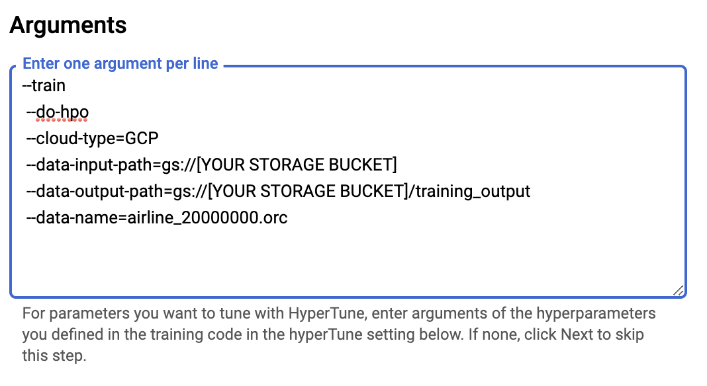
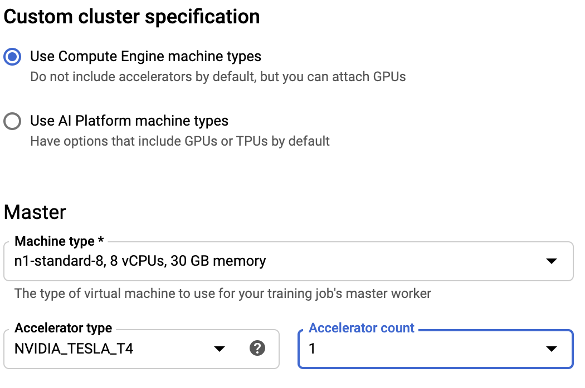

## Quick start guide
Here we will go over some common tasks, related to utilizing RAPIDS on the GCP AI Platform. Note that strings containing '[YOUR_XXX]' indicate items that you will need to supply, based on your specific resource names and environment.

### Deploy a custom RAPIDS training container utilizing the 'airline dataset', and initiate a training job with support for HyperParameter Optimization (HPO)
Motivation: We would like to be able to utilize GCP's AI Platform for training a custom model, utilizing RAPIDS.  
Workflow: Install the required libraries, and authentication components for GCP, configure a storage bucket for persistent data, build our custom training container, upload the container, and launch a training job with HPO.

1. Install GCP 'gcloud' SDK
    1. See: https://cloud.google.com/sdk/install
1. Configure gcloud authorization for docker on your build machine
    1. See: https://cloud.google.com/container-registry/docs/advanced-authentication
1. Configure a google cloud object storage bucket that will provide and output location 
1. Build the custom container
    1. `$ cd gcp/docker`
    1. `$ docker build --tag gcr.io/[YOUR_PROJECT_NAME]/rapids_training_container:latest --file Dockerfile.training .`
    1. `$ docker push gcr.io/[YOUR_PROJECT_NAME]/rapids_training_container:latest`
1. Training via GCP UI
    1. A quick note regarding GCP's cloudml-Hypertune
        1. This library interacts with the GCP AI Platform's HPO process by reporting required optimization metrics to the system after each training iteration.
        ```python
            hpt.report_hyperparameter_tuning_metric(
            hyperparameter_metric_tag='hpo_accuracy',
            metric_value=accuracy)
        ```
        1. For our purposes, the 'hyperparameter_metric_tag' should always correspond to the 'Metric to optimize' element passed to a job deployment.
    1. Training Algorithm
        1. From the GCP console select 'jobs' -> 'new training job' -> custom code training
        1. Choose 'Select a container image from the container Registry'
        1. Set 'Master image' to 'gcr.io/[YOUR_PROJECT_NAME]/rapids_training_container:latest'
        1. Set 'Job directory' to 'gs://[YOUR_GOOGLE_STORAGE_BUCKET]'
    1.  Algorithm Arguments
        1. Ex:      
        1. ```bash
            --train
            --do-hpo
            --cloud-type=GCP
            --data-input-path=gs://[YOUR STORAGE BUCKET]
            --data-output-path=gs://[YOUR STORAGE BUCKET]/training_output
            --data-name=airline_20000000.orc
           ``` 
                  
        1. With Hypertune
            1. Enter the hypertune parameters. Ex:
                1. ```bash
                    Argument name: hpo-max-depth
                    Type: Integer
                    Min: 2
                    Max: 8
                1. ```bash
                    Argumnet name: hpo-num-est
                    Type: Integer
                    Min: 100
                    Max: 200
                   ```
                1. ```bash
                    Argument name: hpo-max-features
                    Type: Double
                    Min: 0.2
                    Max: 0.6
                   ```
            1. Enter an optimizing metric. Ex:
                1. ```bash
                    Metric to optimize: hpo_accuracy
                    Goal: Maximize
                    Max trials: 20
                    Max parallel trials: 5
                    Algorithm: Bayesian optimization
                    Early stopping: True
                   ```
                   
    1. Job Settings
        1. ```bash
            Job ID: my-test-job
            Region: us-central1
        1. Scale Tier
            1. Select 'CUSTOM' -> 'Use Compute Engine Machine Types'
            1. Master Node
                1. Ex. n1-standard-8
            1. Accelerator
                1. Ex. V100 or T4. K80s are not supported.
        
        1. Select 'Done', and launch your training job. 
1. Training via gcloud job submission
    1. Update your training configuration based on 'example_config.json'
        1. ```json
            {
                "trainingInput": {
                    "args": [
                        "--train",
                        "--do-hpo",
                        "--cloud-type=GCP",
                        "--data-input-path=gs://[YOUR STORAGE BUCKET]",
                        "--data-output-path=gs://[YOUR STORAGE BUCKET]/training_output",
                        "--data-name=airline_20000000.orc"
                    ],
                    "hyperparameters": {
                        "enableTrialEarlyStopping": true,
                        "goal": "MAXIMIZE",
                        "hyperparameterMetricTag": "hpo_accuracy",
                        "maxParallelTrials": 1,
                        "maxTrials": 2,
                        "params": [
                            {
                                "maxValue": 200,
                                "minValue": 100,
                                "parameterName": "hpo-num-est",
                                "type": "INTEGER"
                            },
                            {
                                "maxValue": 17,
                                "minValue": 9,
                                "parameterName": "hpo-max-depth",
                                "type": "INTEGER"
                            },
                            {
                                "maxValue": 0.6,
                                "minValue": 0.2,
                                "parameterName": "hpo-max-features",
                                "type": "DOUBLE"
                            }
                        ]
                    },
                    "jobDir": "gs://[YOUR PROJECT NAME]/training_output",
                    "masterConfig": {
                        "imageUri": "gcr.io/[YOUR PROJECT NAME]/rapids_training_container:latest",
                        "acceleratorConfig": {
                            "count": "1",
                            "type": "NVIDIA_TESLA_T4"
                        }
                    },
                    "masterType": "n1-standard-8",
                    "region": "us-west1",
                    "scaleTier": "CUSTOM"
                }
            }
        1. For more information, see:
            1. https://cloud.google.com/sdk/gcloud/reference/ai-platform/jobs/submit/training
    1. Run your training job
        1. `$ gcloud ai-platform jobs submit training [YOUR_JOB_NAME] --config ./example_config.json`
    1. Monitor your training job
        1. `$ gcloud ai-platform jobs stream-logs [YOUR_JOB_NAME]`


### Install RAPIDS on a pre-made Notebook
Motivation: We have an existing GCP notebook that we wish to update to support RAPIDS functionality.  
Workflow: We will create a notebook instance, and run a shell script that will install a Jupyter kernel and allow us to run RAPIDS based tasks.  
  
1. Log into your GCP console.
    1. Select AI-Platform -> Notebooks
    1. Select a "Create new notebook". And select the RAPIDS XGBoost variant (comes with Conda installed)
        1. Select 'install gpu driver for me'
        1. Select 'customize'
            1. Pick the CUDA variant you want (10.1, 10.0, etc..)
            1. For your GPU type, select T4, or V100
            1. Select the number of GPUs 1-8
        1. Launch your notebook service.
    1. Once JupyterLab is running
        1. Open a new terminal
        1. Copy the 'rapids-py37-kernel.sh' GCP script into the local environment.
        1. Run the script
            1. Once completed, you will have a new kernel in your jupyter notebooks called 'rapids_py37' which will have rapids installed.

### Deploy a custom RAPIDS container notebook
Motivation: We want to build a custom docker container for the GCP AI Platform, with out of the box support for RAPIDS, and pre-installed Jupyter kernels.  
Workflow: We will build a custom docker container with RAPIDS, using Google's recommended base image, push this container to the Google Container Registry (GCR),
and launch an AI Platform notebook backed on this container.

1. Pull or create custom container
    1. Build locally
        1. `$ cd gcp/docker`
        1. `$ docker build --tag gcr.io/[YOUR PROJECT NAME]/rapids-py37 --file Dockerfile.jupyter_notebook ./`
1. Push to the Google Container Registry
    1. Ensure gcloud is installed and you have configured the GCR authentication helper for Docker.
        1. See: https://cloud.google.com/container-registry/docs/advanced-authentication 
    1. `$ docker push gcr.io/[YOUR PROJECT NAME]/rapids-py37`
1. Log into your GCP console.
    1. Select AI-Platform -> Notebooks
    1. Select a "New Instance" -> "Customize Instance"
        1. Name your instance
        1. Select Environment -> Custom Container
            1. Enter: gcr.io/[YOUR PROJECT NAME]/rapids-py37 
        1. Select 'install gpu driver for me'
        1. Select 'customize'
            1. For your GPU type, select T4, or V100
            1. Select the number of GPUs 1-8
        1. Launch your notebook service.
    1. Once JupyterLab is running, you will have a kernel available in your jupyter notebooks called 'rapids_py37' which will have rapids installed.
